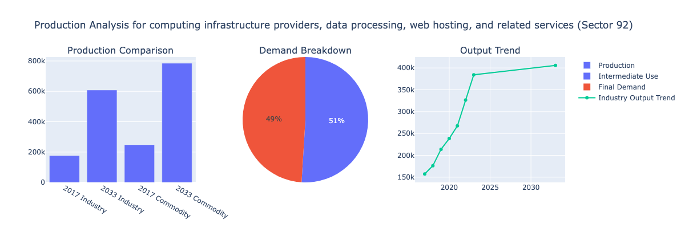

# Miguel Mateo Osorio Vela - Data Science & Computational Projects

This repository contains projects demonstrating my skills in data analysis, computational modeling, and automata theory applications.

## Projects Overview

### 1. Input-Output Analysis of the U.S. Economy
A comprehensive economic analysis using the Leontief Input-Output Model to analyze sector interdependencies and forecast economic behavior through 2033.

### 2. Credit Card Validation Using DFA and Luhn's Algorithm
An implementation of a Deterministic Finite Automaton (DFA) that validates credit card numbers by applying issuer-specific rules and the Luhn algorithm.

## 1. Input-Output Analysis of the U.S. Economy

### Description
This project establishes correlations between different sectors of the U.S. economy using historical behavior (1997-2023) and creates forecasts for economic activity in 2033. The analysis implements the Leontief Input-Output Model to examine how 166 different economic sectors interact.

### Key Features
- **Data Sources**: Bureau of Economic Analysis datasets including USE Matrix, MAKE Matrix, and Real Industry/Commodity Output Tables
- **Model Implementation**: 
  - Market share matrix construction
  - Direct inputs coefficient matrix derivation
  - Consumption matrix computation
  - Leontief inverse matrix calculation
- **Forecasting**: Projected economic behavior through 2033 based on historical growth rates
- **Visualizations**: Interactive charts using Plotly to compare industry and commodity outputs, demand components, and projected growth

### Key Findings
- The analysis confirms the U.S. economy remains productive and capable of meeting projected demand through 2033
- Significant sector shifts identified:
  - Coal mining shows a projected 30.6% decline from 2017 to 2033
  - Technology-driven sectors like computing infrastructure exhibit substantial growth (245%)

### Tools & Technologies
- Python (NumPy for computation)
- Plotly for interactive data visualization

### Sample of visualization

  

## 2. Credit Card Validation Using DFA and Luhn's Algorithm

### Description
This project implements a Deterministic Finite Automaton (DFA) to validate credit card numbers by applying issuer-specific rules and simultaneously computing the Luhn checksum. The system efficiently validates card numbers in a single pass.

### Key Features
- **Card Validation**: Verifies numbers based on issuer-specific prefixes and length requirements
  - Visa: Cards starting with '4' (13 or 16 digits)
  - MasterCard: Cards starting with '51' through '55' (16 digits)
  - American Express: Cards starting with '34' or '37' (15 digits)
- **Integrated Checksum**: Calculates Luhn algorithm checksum during state transitions
- **Visualization**: DFA structure visualization using Plotly

### Implementation
- Python implementation in Jupyter Notebook environment
- Visual representation of the DFA for validation and debugging

### Results
The system successfully classifies credit card numbers based on:
- Issuer-specific rules (prefix and length)
- Mathematical validity (Luhn checksum)

### Tools & Technologies
- Python
- Jupyter Notebooks
- Plotly for visualization
- JFlap for DFA design and visualization

## Repository Structure

```
├── README.md
├── economic-analysis/
│   ├── input_output.ipynb
│   └── data/
│       └── (data files)
├── credit-card-validator/
│   ├── DFA_credit_validator.ipynb
│   └── data/
│       └── (data files)

```

## Getting Started

### Prerequisites
- Python 3.8+
- Required packages:
  ```
  numpy
  pandas
  plotly
  jupyter
  matplotlib
  ```


