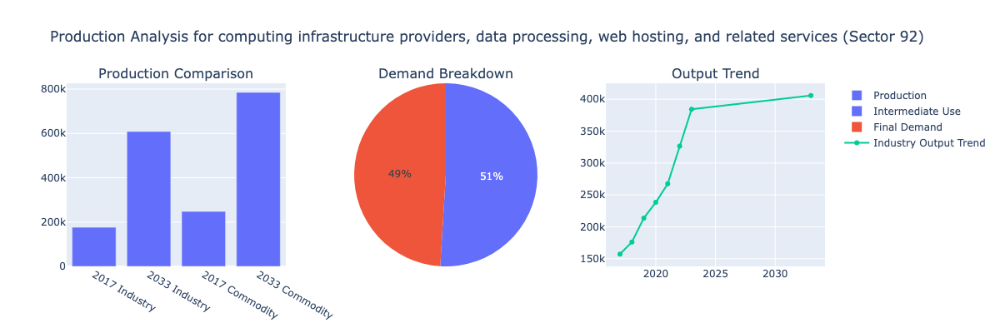

# Input-Output Analysis of the U.S. Economy

### Description
This project establishes correlations between different sectors of the U.S. economy using historical behavior (1997-2023) and creates forecasts for economic activity in 2033. The analysis implements the Leontief Input-Output Model to examine how 166 different economic sectors interact.

### Key Features
- **Data Sources**: Bureau of Economic Analysis datasets including USE Matrix, MAKE Matrix, and Real Industry/Commodity Output Tables
- **Model Implementation**: 
  - Market share matrix construction
  - Direct inputs coefficient matrix derivation
  - Consumption matrix computation
  - Leontief inverse matrix calculation
- **Forecasting**: Projected economic behavior through 2033 based on historical growth rates
- **Visualizations**: Interactive charts using Plotly to compare industry and commodity outputs, demand components, and projected growth

### Key Findings
- The analysis confirms the U.S. economy remains productive and capable of meeting projected demand through 2033
- Significant sector shifts identified:
  - Coal mining shows a projected 30.6% decline from 2017 to 2033
  - Technology-driven sectors like computing infrastructure exhibit substantial growth (245%)

### Tools & Technologies
- Python (NumPy for computation)
- Plotly for interactive data visualization

### Sample of visualization

  

